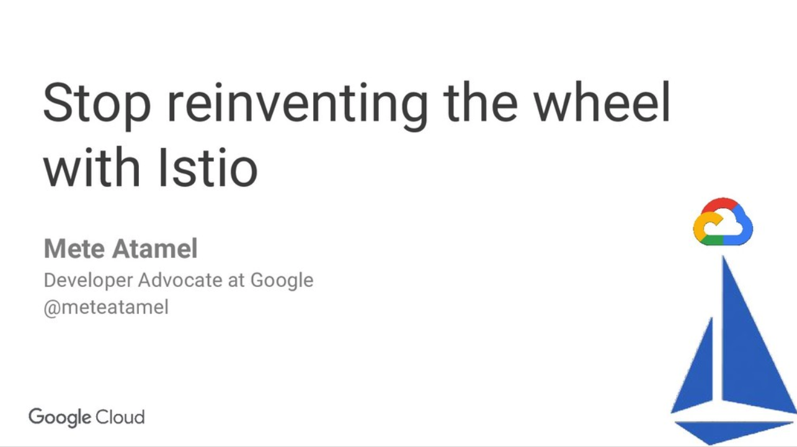

# Istio on GKE Tutorial

This tutorial shows how to use [Istio](https://istio.io/) on Google Kubernetes Engine (GKE) using the [Istio on GKE add-on](https://cloud.google.com/istio/docs/istio-on-gke/overview). 

## Slides

There's a [presentation](https://speakerdeck.com/meteatamel/stop-reinventing-the-wheel-with-istio) that accompanies the tutorial. 

## Pre-requisites
We assume that you have a Google Cloud project with Kubernetes API enabled. [Installing Istio on GKE](https://cloud.google.com/istio/docs/istio-on-gke/installing) explains how to enable Kubernetes API. 

We built and tested tutorial on GKE version `1.12.5-gke.5` with Istio version `1.0.3-gke.3`.   

## Steps

* [Create a GKE cluster with Istio](docs/01-createclusterwithistio.md)
* [Hello World Istio](docs/02-helloworldistio.md)
* [Gateway and VirtualService](docs/03-gatewayvirtualservice.md)
* [Istio add-ons](docs/04-istio-addons.md)
* [Traffic Management](docs/05-traffic-management.md)
* [Cleanup](docs/06-cleanup.md)

-------

This is not an official Google product.
