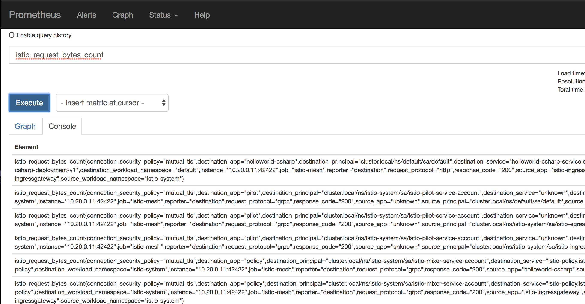
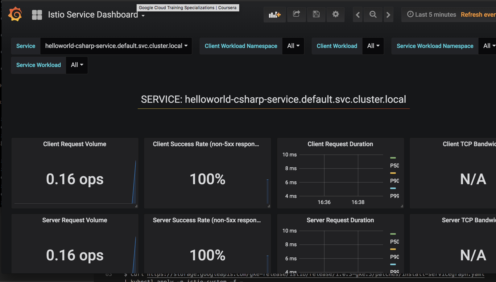
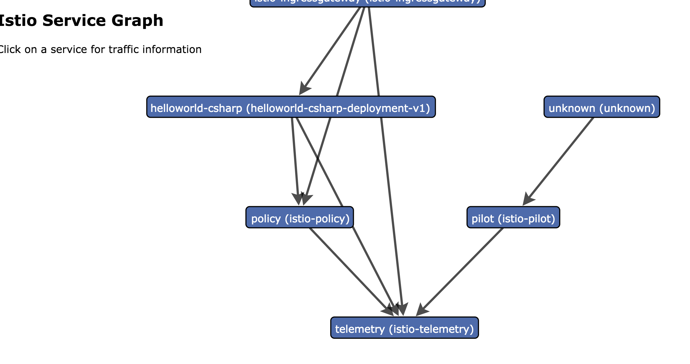
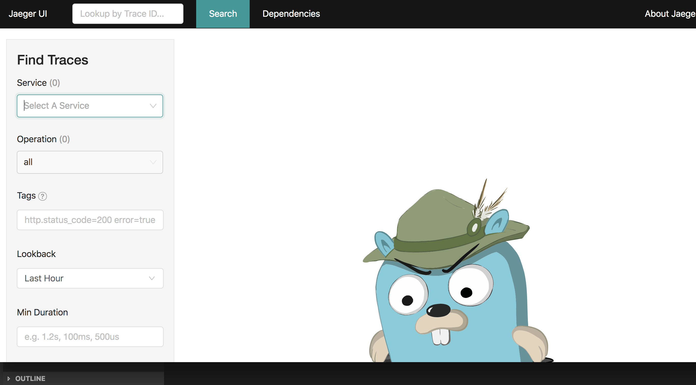

# Istio add-ons
Once you get the basic Istio start managing the traffic of your application, you can add-on services such as Prometheus, Grafana to visualize metrics emitted by Istio sidecar proxy, or Jaeger to look at traces and ServiceGraph to see the dependencies among services. 

## Prometheus
[Prometheus](https://prometheus.io/) is an open-source monitoring solution. You can use Prometheus to query metrics generated by Istio but you need to first install Prometheus add-on.

Install Prometheus:
```bash
curl https://storage.googleapis.com/gke-release/istio/release/1.0.3-gke.3/patches/install-prometheus.yaml | kubectl apply -n istio-system -f -
```

Verify that it's running:
```bash
kubectl get svc prometheus -n istio-system

NAME         TYPE        CLUSTER-IP     EXTERNAL-IP   PORT(S)    AGE
prometheus   ClusterIP   10.31.243.62   <none>        9090/TCP   1d
```

Send some traffic to the application by visiting http://${GATEWAY_URL} a few times or running the `curl` command in a loop: 

```bash
for i in {1..100}; do curl -w "\n" "http://${GATEWAY_URL}" ; sleep 1; done
```

Setup port forwarding for the Prometheus UI:
```bash
kubectl -n istio-system port-forward $(kubectl -n istio-system get pod -l app=prometheus -o jsonpath='{.items[0].metadata.name}') 8080:9090
```

You can now execute a query by clicking on the Web Preview button in the top-right corner of Cloud Shell and click Preview on port 8080. You’ll see the Prometheus UI in a new tab: 



## Grafana
[Grafana](https://grafana.com/) is another add-on for visualizing metrics. 

Install Grafana:
```bash
curl https://storage.googleapis.com/gke-release/istio/release/1.0.3-gke.3/patches/install-grafana.yaml | kubectl apply -n istio-system -f -
```

Verify that it's running:
```bash
kubectl get svc grafana -n istio-system

NAME      TYPE        CLUSTER-IP      EXTERNAL-IP   PORT(S)    AGE
grafana   ClusterIP   10.31.248.230   <none>        3000/TCP   1d
```

Send some traffic to the application by visiting http://${GATEWAY_URL} a few times or running the `curl` command. 

Setup port forwarding for the Grafana UI:
```bash
kubectl -n istio-system port-forward $(kubectl -n istio-system get pod -l app=grafana -o jsonpath='{.items[0].metadata.name}') 8080:3000
```

You can view Grafana dashboards by visiting Web Preview:



## ServiceGraph
Another useful add-on is ServiceGraph for dependency visualization. 

Install ServiceGraph: 
```bash
curl https://storage.googleapis.com/gke-release/istio/release/1.0.3-gke.3/patches/install-servicegraph.yaml | kubectl apply -n istio-system -f -
```

Verify that it's running:
```bash
kubectl get svc servicegraph -n istio-system

NAME           TYPE        CLUSTER-IP      EXTERNAL-IP   PORT(S)
servicegraph   ClusterIP   10.23.249.238   <none>        8088/TCP
```

Setup port forwarding:
```bash
kubectl -n istio-system port-forward $(kubectl -n istio-system get pod -l app=servicegraph -o jsonpath='{.items[0].metadata.name}') 8080:8088
```
And take a look at the service dependencies by visiting `http://localhost:8080/force/forcegraph.html` in Web Preview:



## Tracing
Lastly, we'll install some HTTP tracing add-ons. 

Install tracing:
```bash
curl https://storage.googleapis.com/gke-release/istio/release/1.0.3-gke.3/patches/install-tracing.yaml | kubectl apply -n istio-system -f -
```

Verify that Jaeger is running:
```bash
kubectl get svc jaeger-query -n istio-system

NAME           TYPE        CLUSTER-IP      EXTERNAL-IP   PORT(S)
jaeger-query   ClusterIP   10.23.255.136   <none>        16686/TCP
```

Setup port forwarding:
```bash
kubectl port-forward -n istio-system $(kubectl get pod -n istio-system -l app=jaeger -o jsonpath='{.items[0].metadata.name}') 8080:16686
```

Take a look at HTTP traces of your app by visiting `http://localhost:8080` in Web Preview:



## What's Next?
In this section, we installed some of the add-ons to enhance Istio functionality. In the next section, we'll look at some of the traffic management features of Istio.

[Traffic Management](05-traffic-management.md)